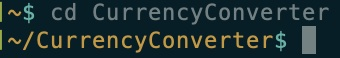
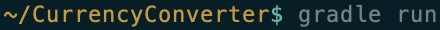
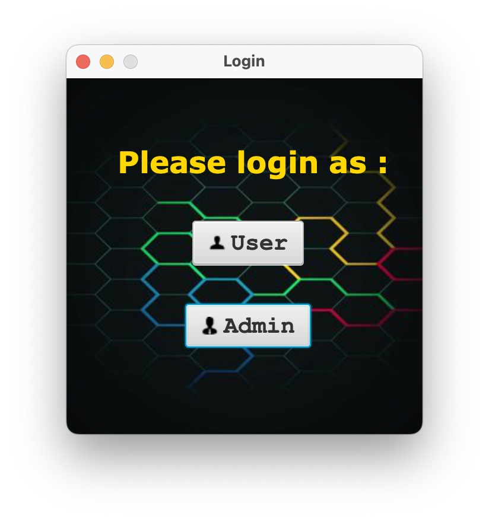
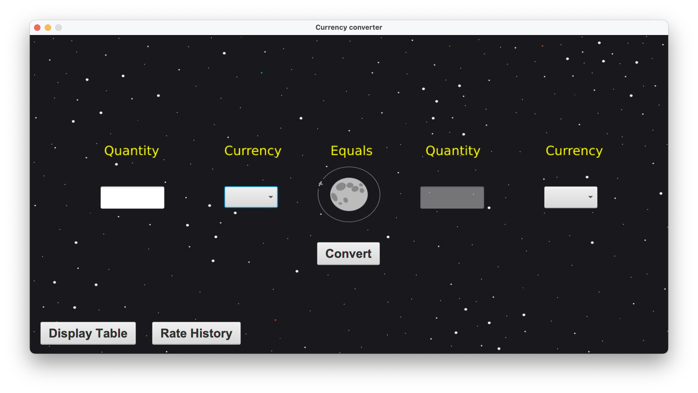
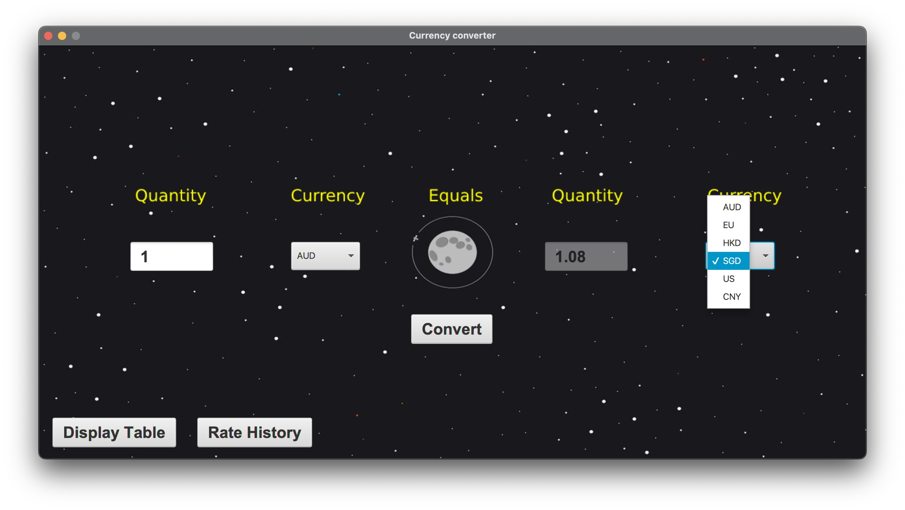
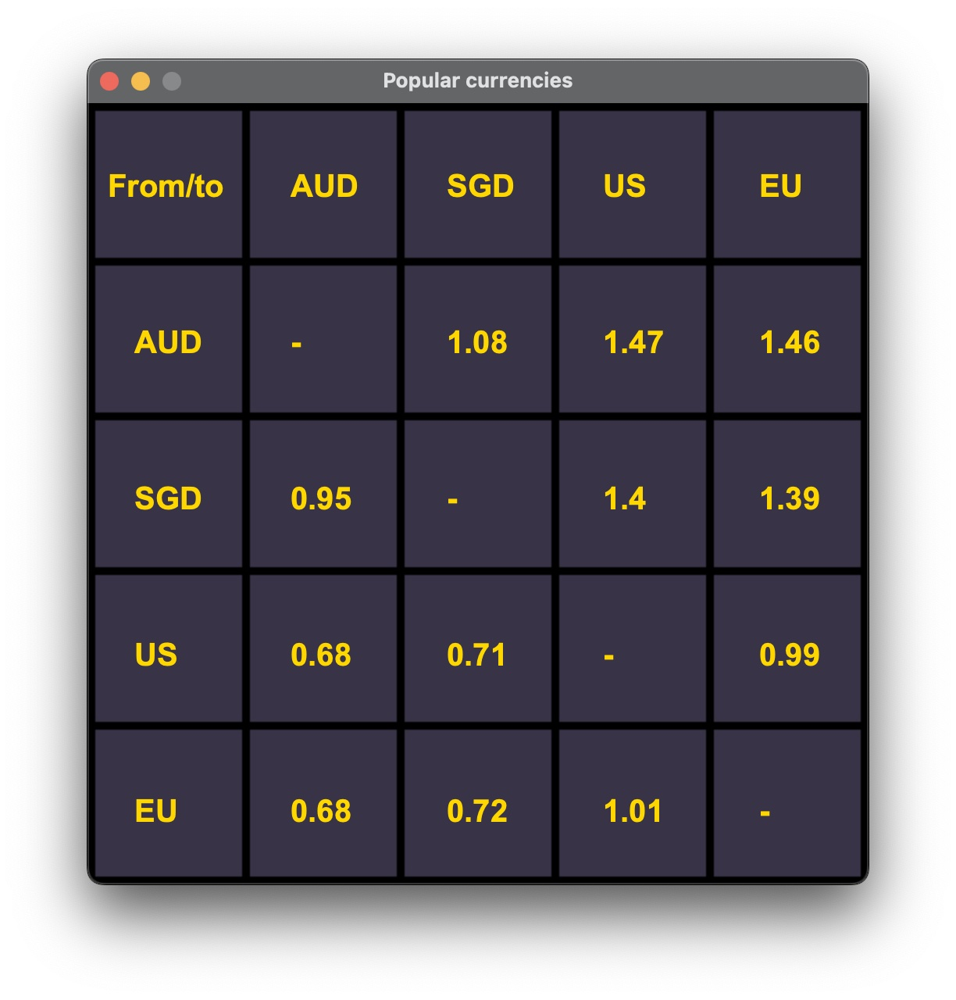
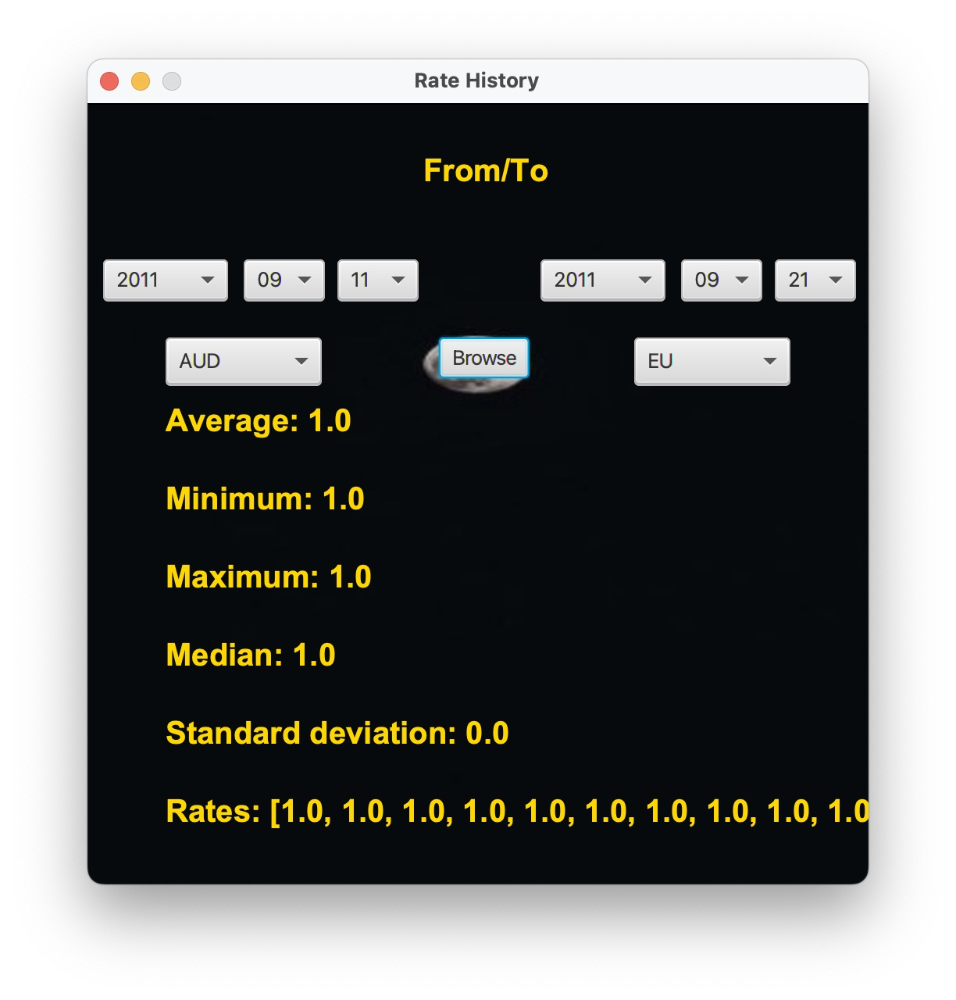
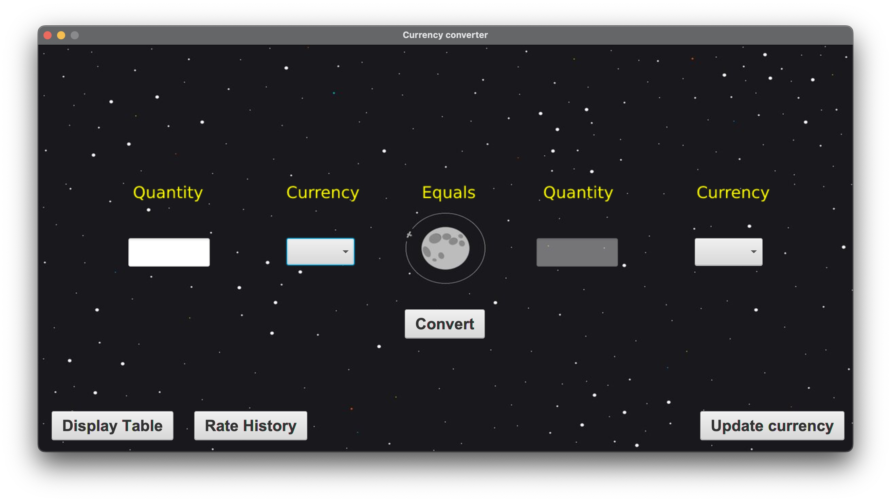
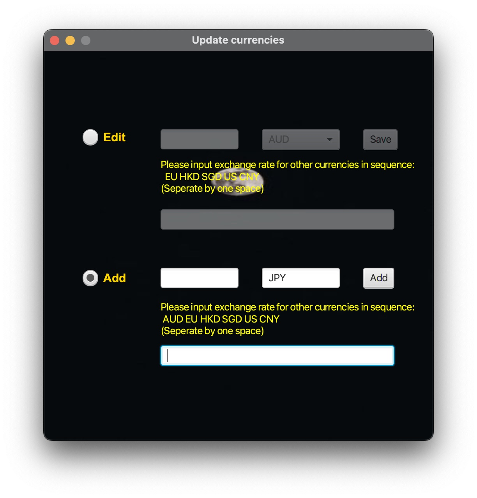
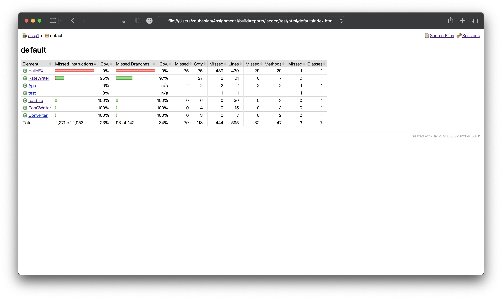

# Currency Converter

***------- Make converting easier***

## Description

The currency converter application, called Currency Converter, converts the amount of one currency into two other currencies. You can choose to display several different currencies, such as Euro, Australian dollar or US dollar, and enter the value of one currency to convert it to other selected currencies or display a table with exchange rates for several of the most popular currencies. The administrator class can also display the history of various currencies by using the program to add or change updates to the exchange rates.

## Getting Started

### Dependencies
*     JUnit 5.8.1
*  Java 17.0.2
*     JavaFX 17.0.2
* Gradle 7.5
*   Jenkins 2.367
*   IntelliJ IDEA CE

### Installing

* Gradle can be download and installed from [gradle Installation](https://gradle.org/install/)
* IntelliJ can be download and installed from [IntelliJ Installation](https://www.jetbrains.com/idea/download/#section=mac)
* JavaFx can be download and installed from [JavaFX installation](https://openjfx.io/)
* Java can be download and installed from [Java installation](https://www.oracle.com/java/technologies/javase/jdk17-archive-downloads.html)
* Jenkins can be download and installed from [Jenkins installation](https://www.jenkins.io/download/)
* Our program can be downloaded and installed from our github page [Currency Converter](https://github.sydney.edu.au/lche8972/Assignment1)

### Executing program

* Open the downloaded Currency Converter package using the terminal

  ```text
  cd CurrencyConverter
  ```



- Use gradle run to start the program

  ```text
  gradle run
  ```



- The start screen will be presented in front of the screen and you can see the following screen

  

- You log in based on your identity in this screen.If you are User click on this button  or click on the  if you are a administrator

- When logging in as a user we can see the following screen

  

- After entering the correct amount and type of currency and selecting the correct target currency, click Convert () to get the corresponding target currency amount

  

- In addition, we also offer to display the most popular currencies by clicking on Display Table ()

  

- We even have a function to display rate history. And what you should do is click this button().
  
- When you log in as administer, the situation will be slightly different. Apart from all the functions we have mentioned, we also allow the administer to modify the data base by the botton ()

  

- Once the administer click the "" botton, he can see the"edit" and "add". The edit one is used to update the currency rate of manually and the other is for add a new currency type.

  

## Test program

With the Junit test, we set up the Unit tests for our program. Just simply use gradle test command below in the terminal under the  CurrencyConverter file. Code coverage could be found under the ~/CurrencyConverter/build/reports/jacoco/test/index.html. Just click on this html file ,you can read the full test report with your browser such as (chrome, safair).
```test
gradle test
```



**<u>Only the backend code have been test</u>**

## Authors

| Name                                                         | Student ID    |
| ------------------------------------------------------------ | ------------- |
| [**Bruce Bi**](https://canvas.sydney.edu.au/groups/372974/users/267113) | **510472287** |
| [**Lining Chen**](https://canvas.sydney.edu.au/groups/372974/users/276379) | **510522489** |
| [**Jihuai Mo**](https://canvas.sydney.edu.au/groups/372974/users/253683) | **500715981** |
| [**Weichen Yuan**](https://canvas.sydney.edu.au/groups/372974/users/281711) | **510079983** |
| [**Haolan Zou**](https://canvas.sydney.edu.au/groups/372974/users/219242) | **500184187** |

## Version History

* 0.2
    * Various bug fixes and optimizations
    * See [commit change]() or See [release history]()
* 0.1
    * Initial Release
